# Analise de Trafego e Rede

### RFC
RFC sao documentos que regulam o funcionamento da internet.

  - Algumas RFCs importantes para analise de trafego: 768,791,792, 793, 1122, 6890, 8200
  - Ferramentas para auxilio tshark, wireshark, mtr, ping, netcat, iptraf, packit e tcpdump.
  - [orgão responsavel pela homolocação da RFC](https://www.ietf.org)
  - Auxilio  para testes e estudo: simulador de redes CORE.

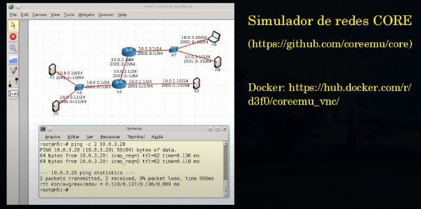

 

### Estrutura de um protocolo
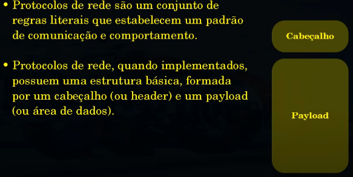

 

### Protocolo IP
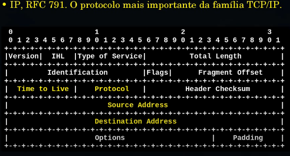

  - Protocolo IP e formado por 32Bits.
  - [**Version**]: os primeiros 4 bytes se referem a versao.
  - [**IHL**]: internet header length: tamanho do cabeçalho **internet**.
    - internet se refere a o nome do protocolo, "internet protocol ip".
  - [**Type of Service**]: e 1byte inteiro, "8bits" que utilizado para qualidade de serviço. Normalmente ele vem zerado.
  - [**Total Length**]: Tem 2bytes, e o tamanho em bytes de todo ip e todo payload ipv4 pode ter ate 65.535bytes de tamanho.
  - [**Fragment Offset**]: Utilizado na fragmentacao do ip. Se estiver marcada com 1, nao fragmente caso esta marcado com zero podera fragmentar.
  - [**Flags**] Sao 3Bytes, normalmente vem zerada
  - [**TTL ou Time to Live**] 8bytes e o tempo pela RFC medido em Hop "salto". Tempo de vida de um pacote.
    - Hop ou salto e numero de vezes que um pacote passa por um roteador.

Utilizando o comando "mtr" para exemplificar o Hop:

`root@terminal:~# mtr -n yahoo.co.jp`

 - Snt indica que o mtr faz envio continuo
 - **Loss** e a porcentagem de perda de pacote. No oitavo Hop pode ser visto que teve uma perda grande de pacote 96.6%
 - Do 1 ate 19 sao numero de roteadores que pacote passou ate seu destino que e o 20.

Funcionamento do **mtr**.
  - Para o mtr saber o caminho, por exemplo da qui ate Japao. Ele manda um pacote para yahoo do Japao com TTL=1, quando chega no primeiro roteador ele leva zero, manda um icmp dizendo, "Seu pacote foi destruido ttl expirado". Agora sabendo quem e o roteador que esta na frente, ele envia novamente pacote para o mesmo endereco, so que desta vez com TTL=2, fazendo esse percurso ate saber todos os Hops que pacote faz ate o destino.
 
  
 
Utilizando o "ping"

`root@terminal:~# ping -c4 yahoo.co.jp`

  - Neste exemplo, e enviado um ping para o endereco indicado, ele       retorna o pong.
    - Pong e a resposta que a maquina do servidor enviou para o destinatario que fez a request.
  - [**rtt**] Round Triple Time. E o tempo de resposta de ida e vinda.
  - [**ttl=49**] E tempo de vida que um pacote pode ter. Ele e produzido pelo sistema operaciona e colocado dentro do pacote ip, e a cada roteador que ele passa "Hop" perde 1. Caso chegue a zero, esse roteador que tirou, tem que destruir esse pacote e informar para a origin que o ttl expirou.
  
Os sistemas operacionais possuem um ttl padrao.
   - Unix e derivados tem ttl 255
   - Windowns 128
   - Linux 64

Nesse caso e possivel saber que o servidor a qual foi enviado o pacote se trata de um linux. Analisando esse caso, vejamos:
  Por cada roteador que pacote passou, ate chegar aqui ele perdeu 1, ele teve em media 30 saltos "Hop", sabendo que nao se gasta mais de 30 saltos para atravesar o mundo, poderiamos dizer que teria 30 + 49 = 79.
  Se baziando nisso poderiamos chegar a 128 ou 64 de ttl. Nesse caso a opcao mais plausivel e ttl=64.

A casos em que o ttl pode ser alterado, dificultando assim a analise.
  
  Vejamos o exemplo:
  
`root@terminal:~# cat /proc/sys/net/ipv4/ip_default_ttl`

  - O diretorio **/proc** controla propriedades do kernel.
  - Caso altere o valor de 64 para 50 por exemplo o ttl dos pacotes sera setado para 50.
  
 
  
`root@terminal:~# traceroute -n yahoo.co.jp`

  - O traceroute tradicional mostra a rota.
  - Diferente do mtr o traceroute nao e ciclico, ele nao fica forcando uma resposta.
  
 

  - [**Header Checksum**] E calculado de dois em dois bytes, esse calculo e feito em cima do cabecalho. A cada pacote recebido o roteador tem que calcular o checksum pois, tem que diminuir um no TTL. No caso do ipv6, ele nao possui checksum no cabecalho, esse e um dos motivos que fazem do ipv6 ser mais rapido, pois diminui o tempo de processamento do roteador.
  
  - [**Source Adress**] E o endereco de ip de origem, que um dado obrigatorio.
  
  - [**Destination Adress**] O testino do pacote enviado.
  
  - [**Option**] Geralmente os pacotes nao usam. Sao quatro Options classicos no ip, sao eles:
    - **Time Stamp** para voce gravar dentro do campo option que vai ate 10 linhas a data e hora de passgem que um pacote faz por cada roteador.
    - **Record Root ou RR**. E a garavacao de todas sequencias de ips da ida ate a volta.
    - **Lose Root**. Exemplo do seu funcionamento e que se ele armazena tres ips, o seu pacote tem que passar por esses tres ips ate o seu destino. Nao importanto se ele passar por outro ip, mas ele tem que passar pelo tres ip la descritos, fazendo assim que seu pacote seja guiado.
    - **Struct Root**. Informando os ip nele faz com que o pacote so passe pela queles roteadores la descritos, fazendo um percurso restrito.

- [**Protocol**] O ip so conseugue carregar um tipo de dado dentro dele, um outro protocolo de rede, que sao chamados protocolos ip.
Segue o exemplo a baixo:

  `root@terminal:~# less /etc/protocols`
  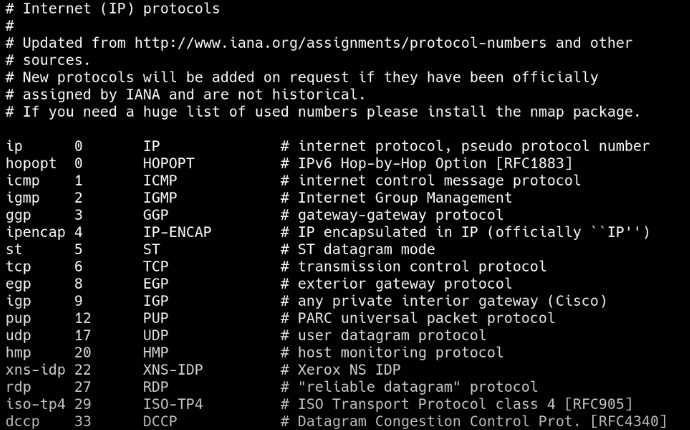
  - Aqui e exibido os protocolos que andam dentro do ip. Um dos conhecidos que e informado sao: tcp, icmp e tcp

 
  
- [**Padding**] E como se fosse a rolha do pacote, pois o cabecalho ip e multiplo, entao ele tem que fechar sentinho 32bits. Para isso e acrecentado zero nela ate fechar 32Bits.

 

Capturando o primeiro pacote. Representando em hexadecimal. Neste exemplo sera possivel ver todo cabecalho do pacote.

`root@terminal:~# tcpdump -n ip -c 1 -x`
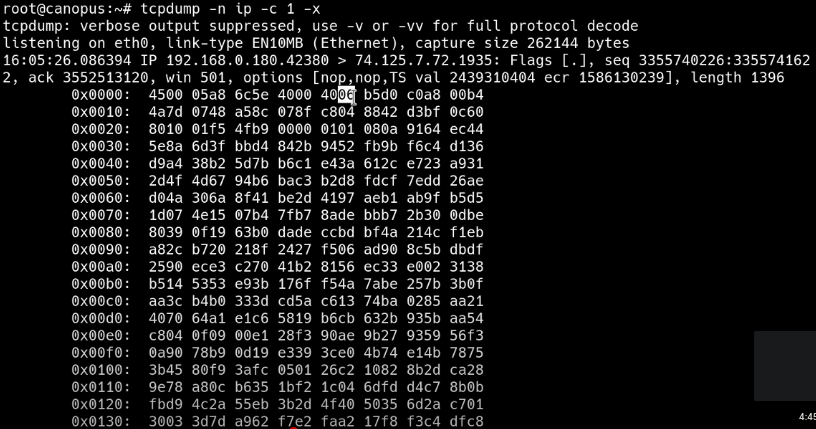

 

Descricao do formato do ip: [**0.0.0.0./8**]

"Esta maquina/Esta rede"
  - Os primeiros 4 zeros, sao esta maquina, ou seja a maquina pessoal.
  - /8 e esta rede. A rede em que a maquina esta.

Para exemplo se fizer ping para propria maquina, o kelnel do sistema operacional ira responde.

Nesse caso ainda que a maquina nao tenha placa de rede, avera o retorno do pong. Pois e respota do kernel do sistema.

`root@terminal:~# ping -c2 0.0.0.0`
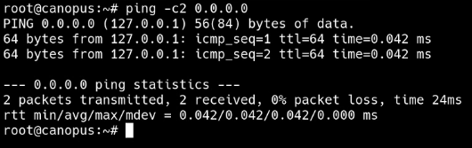

 

Como podemos observar **0.0.0.0** nao significa default, e sim esta rede.

`root@terminal:~# router -n`

  - Analisando a imagem, **0.0.0.0** e a representacao de todas as redes em que a maquina esta conectada na quele momento. Nesse caso **0.0.0.0** personifica:
    - 172.17.0.0
    - 192.168.0.0
  
  
  - E para ele chegar ate essa rede e atraves do Roteador, "192.168.0.2", que e o gateway.
    - **Roteador** e uma maquina que tem varias placas de rede, e cada placa de rede tem um ip e cada ip se chama gateway. Entao Gateway e um ip que me leva para outro segmento de rede.
  
  Entao 192.168.0.2 e o gateway deste roteador que me leva para as demais redes la descritas na imagem.
  
 

### Protocolo tcp

  - Protocolo tcp tem 32 bits de lagura, 16 bits inicias sao porta de origem, e os 16 bits finais sao a porta de destino.
  - [Source Port] 16 bits iniciais.
  - [Destination Port] 16 bits finais.
  - [Data Offset] tem 4 bits e onde começa o payload.
  - [Options] pode ter ate 10 linhas, e diferente do ip normalmente ele vem configurado.
  
### Flags TCP

  - [Syn] synchronize, Inicia conexao.
  - [Fin] finish, finaliza conexoes.
  - [Psh] push, envia dados.
  - [Ack] acknowledgment, confirmad de que e conhecido o numero de      sequencia do proximo seguimento a ser enviado pelo lado oposto.
  - [Rst] reset, nao entendi.

Para se iniciar uma conexao, utiliza se flag **Syn**. Sempre e o clinete que inicia uma conexao e numca o servidor.

Chegando a conexao no servidor ele devolve uma confirmacao da conexao, **Ack**. O tcp e um protocolo orientado a conexao.

Sao tres metodos de difucao de dados, sao eles:
  - **Syn-plex**
    - Eu falo e voce escuta, ex: tv e radio.
  - **Half-duplex**
    - Os dois podem falar, mas cada um no seu tempo, ex: radio de comunicao militar e nextel.
  - **Full-duplex**
    - Os dois podem falar a o mesmo tempo ex: telefone.

Primeira coisa que um servidor faz e testar a conexao. Servidor vai disser Syn, e o cliente responde Ack. Agora o cliente tenque testar a conexao dele ate o servidor, cliente diz Syn, servidor responde Ack. Veja exemplo:

   C/S     |   C/S    | Flags
-----------|----------|------
Cliente    | Servidor | [SYN]
Servidor   | Cliente  | [ACK]
Servidor   | Cliente  | [SYN]
Cliente    | Servidor | [ACK]

 

O protocolo http se encontra dentro do tcp, por isso ele entra pela porta 80, pois a porta 80 e porta do tcp. O protocolo http e o push do tcp. Processo de payload se se monta da seguinte forma.

Cliente responde [Psh], aqui ele pede o index para o servidor.

Servidor respode [Ack], em seguida o servidor respode com [Psh] que e o index da pagina.

Quando cliente recebe o [Psh] ele responde com um [Ack]. Caso a pagina seja muito grande o servidor ira enviar outro [Psh] , cliente responde [Ack], ate que pagina esteja completa.

Quando chega a o final tanto o cliente tanto servidor pode finalizar a conexao, sendo assim servidor responderia [Fin], cliente responde [Ack]. 
Aqui fechou o canol do servidor para cliente. 

Agora falta fechar do cliente para servidor. Entao cliente responde [Fin], servidor respode [Ack].

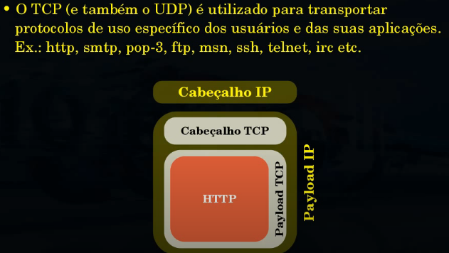

O ip nessa figura, que e o encapsulamento e igual uma encomenda dos correios. Voce nao ve o que esta dentro apenas fora, fora e o ip. Entao quando pacote chega, ele chega como ip. Voce abre ele, descarta o ip e surge um tcp de dentro do ip. O tcp nao enxerga o ip apenas as portas, nessa caso a porta 80.

 

### Utilizando telnet com tcpdump

Utilizando o telnet para fazer conexao tcp e usuando tcpdump para monitorar a conexao.

`root@terminal:~# tcpdump -ni lo port 80`
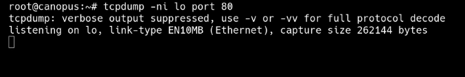
  - aqui tcpdump esta monitorando a porta 80

`root@terminal:~# telnet 127.0.0.5 80`

  - aqui telnet inicia uma conexao na porta 80. Apartir dai o tcpdump comeca sua captura de trafego de rede. Exemplo a baixo:

Analisabdo conteudo em ascii2

`root@terminal:~# tcpdum -nr arquivo.pcap -A | less`
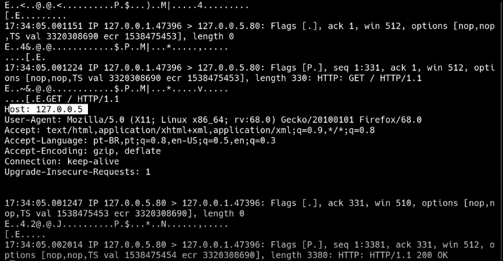
  - aqui e pessivel ver detalhas do payload, ex:
    - navegador Mozila firefox apartir de um ambiente grafico x11.
    - sistema operacional linux

Obs: Exelente programa para fazer extracao de png e o **tcpxtract**.

 

### UDP

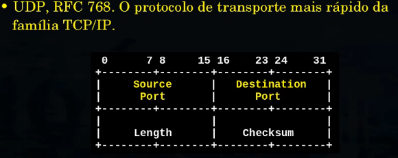

  - UDP nao e orientado a conexao e tem 32 bits de lagura.
  - checksum do UDP e opcional.
  - udp nao tem flags.
  - netcat e utilizado para conexao upd e tcp.
  
Ferramenta exelente para injecao de pacotes e o **packit**.

 

### ICMP

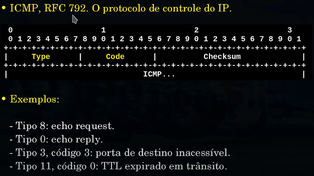
  - Ele e essencial para controle dos procolos ip com execao do tcp que se auto controla.
  - e utilizado para controlar as atividades de rede.
  - Nao se bloqueia ICMP em redes! Isso nao cria seguranca e sem descontrole. O correto e controlar o ICMP pelo sistema de firewall.
  - Sistemas de firewall sao compostos por diversos elementos  como filtros de pacotes, proxies, IDS, IPS, verificadores de rede integridades etc. Firewall nao controlam somente TCP e UDP.
  
 

### Modelo OSI

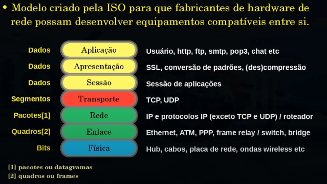
