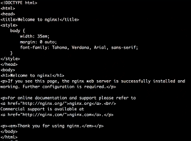
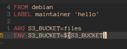

# 

`root@terminal:~# docker container run hello-world`

Existem duas formas de executar container.
  - Modo daimon, que roda em background.
  - Modo interativo.

`root@terminal:~# docker container run debian`

  - Baixando imagem debian e executando.

`root@terminal:~# docker container ps`

  - Lista quais sao containers ativos.
  - A opcao "-a" lista todos os containers, mesmo a queles que estao parados.

`root@terminal:~# docker container run --rm debian`

 - Executa o container e ao final da execucao ele deleta o container da lista.
 
 `root@terminal:~# docker container run -it debian bash`
 
  - Executa o container e entra no modo interativo do bash.
  
Containers devem ter nomes unicos.

`root@terminal:~# docker container run --name mydebian -it debian bash`

  - Cria um novo container nomeado por mydebian apartir da imagem debian.

`root@terminal:~# docker container start -ai mydebian`

  - Reutilizacao de container
  - "-ai", atocha um terminal de forma interativa
  
 

O docker engine tem diversos mecanismos para conseguir fazer isolamento de uma forma segura do seu container com a maquina host. 

Entretanto nao faz sentido termos um container completamente isolado, o que queromos na verdade e termos um isolamento controlado.

Por isso e importante que compartilhermos algumas coisas.

  Comunicao dos containers ex:
  
  - Uma porta, para que alguem consiga acessar um servico.
  - Compartilha uma pasta entre a maquina host e o seu container.
  - Copiar arquivos para o container, ou da maquina host para container.
  - Outra forma de comunicao seria entre os proprios containes. Uma aplicacao sendo configurada em multiplos containers.
  
### Como mapear as portas dos containers

Vamos instalar um servidor chamdo **nginx**, mapeando a porta 8080

`root@terminal:~# docker container run -p 8080:80 nginx`

  - A opcao "-p" e para fazer o mapeamento.
  - A primeira porta 8080, e a porta que vai ser exposta para fora do container.
  - Porta 80 e porta interna do container a qual ele sera startado por padrao.
  - nginx e a imagem a qual sera baixada.
  
`root@terminal:~# curl http://localhost:8080`
  

   - Aqui ira retornar a pagina.

 

### Como mapear um volume

`root@terminal:~# docker container run -p 8080:80 -v $(pwd)/html:/usr/share/nginx/html nginx`

  - A opcao "-v" para mapear um volume.
  - Aqui eu quero que o nginx para de apontar para pasta padrao do container e aponte para pasta na maquina host.

 

### Rodando servidor web em background

`root@terminal:~# docker container run -d --name ex-daemon-basic -p 8080:80 -v $(pwd)/html:/usr/share/nginx/html nginx`

Verificando se container esta rodando

`root@terminal:~# docker container ps`

Encerrando o container

`root@terminal:~# docker container stop ex-daemon-basic`

  - informar nome do container, "ex-daemon-basic"
  - Acrecentar a opcao "stop"

 

### Gerenciando container em background

`root@terminal:~# docker container start ex-daemon-basic`

  - Opcao "start", inicializa o container.

`root@terminal:~# docker container restart ex-daemon-basic`

  - Opcao "restart", reinicializa o container
  
OBS: Outra forma de se referencia ao container no lugar do nome, e utilizar o **container id**.

Exemplo:

`root@terminal:~# docker container stop ec2df06d912a`

 

### Manipulcao de container em modo daemon

`root@terminal:~# docker container ps`

`root@terminal:~# docker container list -a`

`root@terminal:~# docker container ls`

Como acessar logs de um container

`root@terminal:~# docker container logs ex-daemon-basic`

  - Para acessar logs do container, primeiramente o container tem que estar sendo executado.

`root@terminal:~# docker container inspect ex-daemon-basic`

  - Ira exibir em formato json, varias caracteristicas do container.

`root@terminal:~# docker container exec ex-daemon-basic uname -or`

  - Exibe o sistema operacional que esta sendo executado dentro do container.

`root@terminal:~# docker container rmi ex-daemon-basic`

  - A opcao "rmi", remove uma imagem.

 

Opcao de help

`root@terminal:~# docker container --help`

`root@terminal:~# docker image --help`

`root@terminal:~# docker volume --help`

 

### Criando uma image

Crie o arquivo **Dockerfile**.

`
  FROM nginx:latest 
  RUN echo '<h1>Hello World!</h1>' > /usr/share/nginx/html/index.html
`
`root@terminal:~# docker image build -t ex-simple-build .`

  - Executa o Dockerfile para criar a image.

Agora podemos executar o container apartir dessa imagem.

`root@terminal:~# docker container run -p 80:80 ex-simple-build`

  - Executando o comando e abrindo navegador na porta 80, podera ver container rodando.

 

Outro exemplo de Dockerfile.

 

