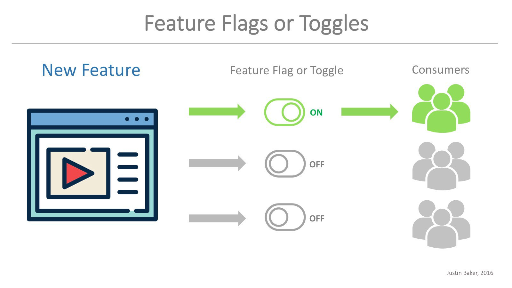

# Feature Toggle

O que e feature toggle ?

Feature toggles e um padrão de projeto onde você coloca interruptores no meio dos seus codigos, que vão possibilitar que você ligue e desligue partes do seu codigo baseando se em varias coisas, uma delas e as funcionalidades.

### Feature flags

São os interruptores, os toggles que você coloca dentro do seu codigo.

### Quais as vantagens ?

A primeira vantagem, e que você pode efitivamente trabalhar com ***trunk based***. Você não tera varias ***branchs*** para fazer ***merge*** e subir em produção, você vai ter uma unica ***branch*** onde todo mundo vai commitar la, so que o codigo que as pessoas subirem vai estar desligado. Isso pode subir para homologação, produção, so que isso vai estar desligado.

  - Primeira vantagem e que você não sofrer com ***merge***, evitando a queles problemas, (funcionava e depois do merge nao funciona mas).
    - Outra coisa e que se der problema na quele pedaço de codigo em produção, você consegue desligar a quele pedaço de codigo. Essa e a grande vantagem desse conceito.

