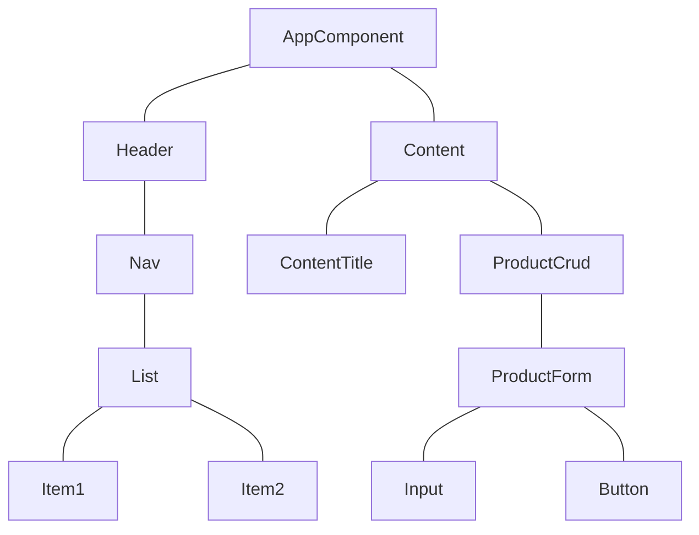
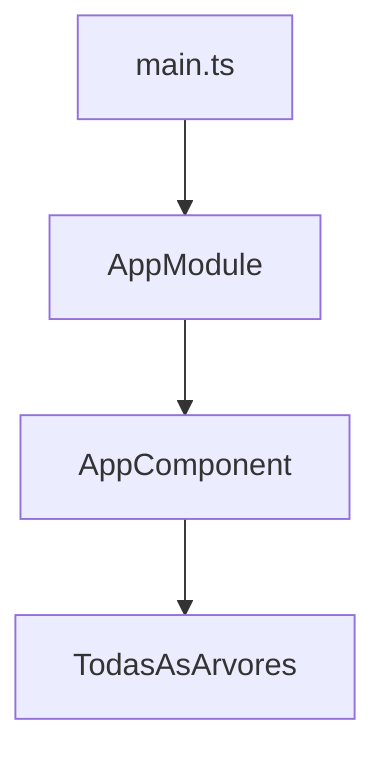
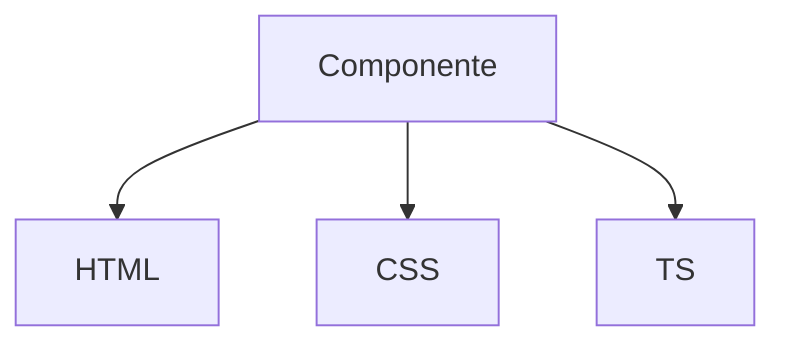
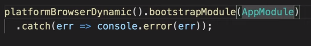
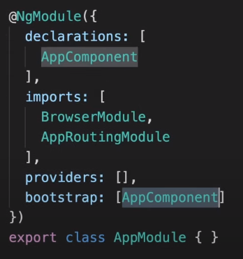

# 

# Introdução ao Angular 9

## Criando back-end com json-server

Json-serve e uma biblioteca que simula uma API REST com json.

```
mkdir backend
cd backend
npm init -y
```

Dentro da pasta, com npm ja instalador, faça;

```
npm i json-server
```

Criando arquivo db.json dentro da pasta, para ser banco de dados que ira servir o front-end.

```
{
    "products": [
    {
        "id": 1,
        "name": "Caneta Bic Preta",
        "price": 5.89
    },
    {
        "id": 2,
        "name": "Notebook Mac Pro",
        "price": 12000.89
    },
    {
        "id": 3,
        "name": "Sansung S20+",
        "price": 5000.89
    }
  ]
}
```

Dentro do arquivo package.json vamos adicoionar as seguintes linhas:

```
"scripts": {
    "start": json-serve --whatch db.json --port 3001"
}
```
Agora faça:

```
npm start
```

Abra o navegordor em: [http://localhost:3001/products](http://localhost:3001/products)

# Criando Front-End

O que e Angular ?

Angular e um framework javascript criando pela google, para criação de aplicações SPA "single page aplication" baseado em componentes.

### Arvore de Componentes do Angular



<br />

### Inicialização da APP

O arquivo ***main.ts***, sera primeiro arquivo que sera chamado para inicialziar sua aplicação em angular.

Em seguida, main.ts chama AppModule. A aplicação angular, e uma aplicação modularizada, pois todos seus componentes se encontram dentro dos modulos.

Dentro do AppModule tera um atributos chamado bootstrap, logo o bootstrap ira apontar para o component AppComponent.

A partir do AppComponet, toda a arvore sera chamada.



O que e um componente:

Componente e um trecho de codigo que representa um componente visual da sua tela.

Dentro de um componente, ele tera, HTML, CSS, TS.



Por padrão, são criando esses tres arquivos:

 - home.component.css
 - home.component.html
 - home.component.ts

Apartir do arquivo.ts sera criando uma tag:

```
<app-home></app-home>
```

# Criando projeto Angular

Para criar projeto do angular, tem que instalar o CLI, que uma dependencia do node. Essa dependencia vai criar um comando que e o ng, apartir disso sera criado projeto com seus modulos e componentes.

fora da pasta backend, escreva o comando:

```
npm i -g @angular/cli
```

Instalado o CLI, agora vamos criar o projeto.
Sera utilizado a versão minimal, para ter menos arquivos.
```
ng new frontend -minimal
```

Agora dentro da pasta frontend para inicializar o projeto:

```
npm start
```

Projeto sera iniciado em [http://localhost:4200](http://localhost:4200)


Dentro do projeto criado, no arquivo angular.json, os atributos inlineTemplete e inlineStyle, sera false.

Com esses atributos setados para false, os templates e arquivos CSS serão criados separadamente.

```
"inlineTemplete": false,
"inlineStyle": false
```

Dentro do arquivo main.ts, podera ver o metodo que chamara o modulo principal ***AppModule***.



Dentro do arquivo app.module.ts, tem a definição do bootstrap que aponta a definição do componente que sera carregado a aplicação.



Dentro da pasta environments, temos os arquivos que são delclados as variaveis de ambiente.


