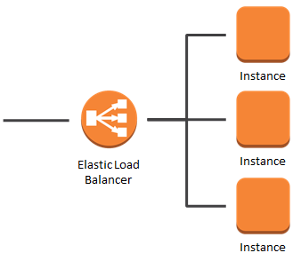

# 

# Introdução ao AWS

## Cloud Compunting

O que e Cloud ?

Cloud e a entrega de recursos de tecnologia e aplicaçoes sobre demanda, utilizando a internet
para entregar e manipular esses recursos com cobranças.

Então, cloud e um servidor terceirizado que faz entrega de dados.

## On-primises

 - data center ou centro de processamento de dados
   - E um predio ou area feita para concentrar servidores, 
  equipamentos de processamento e armazenamento de dados.
 - objetivo
   - Feito para atender demandas computacionais de uma ou mais empressas que trabalham com banco de dados, com um sistema complexo de rede onde se concentram
  switches, cabos, roteadores e etc.

Com isso, on-primise e um servidor pessoal fisico que e da propria pessoa ou empressa 
que detem ele.

## Modelos de Serviços

Modelos de serviços, são formas que a cloud tem serviços para oferecer para você.

 - IaaS
   - E o famoso s2, aqui você sobe suas maquinas, desce suas maquinas, configura elas, middleware eo sistema operacional que roda nela.
 - Paas
   - E mais focado para desenvolvedores, negocios. Sua as configuraçoes aqui sao apenas de dados e as aplicaçoes que irão rodar. A runtime, sistema operacional e configuração de ambiente, nao precisa, aws fazs isso por você. 
 - Saas
   - Software como serviço, aqui você apenas coloca a aplicação para rodar e pronto.

## Serviços Cloud

### 

Principais serviços:

 - Compute
   - Amazon s2, que e um IAs.
   - Aws Lambda.
 - Storage
   - Amazon Cloud front, para entrega de conteudo.
   - Amazon Glacer, para armazenamento de dados frios.  
 - Management and Security
   - Aws Storage Gateway
   - Amazon Content Delivery
 - Database
   - Amazon Dynamo DB, banco dados NoSQL.
   - Amazon RDS, Oracle, SQL Serve, PostGre etc...
   - Amazon Redshift, para trabalhar com silos de dados.
   - Amazon Elastic Cache, para trabalhar com dados em memoria.
 - Network and Connectivity
   - Amazon Route 53, para trabalhar com DNS, dominios etc...
   - Amazon VPC, para criar redes internas e subredes dentro dos dominios da AWS.
   - AWS Direct Connect, para fazer uma conexão direta de um ponto ao outro de forma segura e extremamente rapida.
  
  Outros serviços:

  - AWS IAM
    - AWS IAM e a primeira coisa que voce tem que    criar, voce acessa pela sua conta root, dai você  cria seus grupos e usuarios que irão acessar o seu console ou que ira fazer um acesso programatico pela API. De todos os serviços da aws, esse e o mais importante.
  - AWS SWOT 
    - Faz a analise e monitoramento de metricas do que esta sendo consumido, para saber tudo que esta sendo contado, cobrado, contabilizado e quais horarios que esta sendo usado. Ele e muito bom para saber tudo que esta sendo feito.
  - AWS Code Deploy
    - Para fazer deploy de codigo, colocar suas aplicaçoes, criar pipelines, conexao com git.
  - Amazon Kinesis
    - Basicamente e feito para analise de dados, para quem trabalha com analytics.
  - Amazon SQS
    - Trabalha com mensageria.

##  Regios da AWS

### 

Aws tem data-center em todos os continentes do mundo, exeto antartida.

### Região

Região e onde a AWS concentrar o seu data-center, por questões de segurança, não se sabe onde ficam os data-center, apenas a sua região.

### Pontos de presença da borda (Edge POP)

São impressas parceiras que fazem conexão com data-center da AWS. Numca se acessa a AWS direto, sempre se acessar por essas bordas, um Edge nodes. Que e um servidor de borda que vai fazer intermedio ate a AWS.

## Profissoes Cloud

- Cloud enginers
  - Resposanvel por desenvolver e trabalhar com infra e com software, prontos para lidarem com problemas.(Software)
- Cloud Architects
   - Responsavel por desenhar soluçoes e ssitemas, conhecendo segurança, redes, virtualização e o ambiente cloud que se esta utilizando. (Arquitetura)
- Cloud OPS
   - Resposanevl pela sustentação da infra e segurança. (Infraestrutura)

## Indentity and access management - IAM

Resposanvel por gerenciar as chaves de acesso da aws. Com isso você pode dar e restringir acessos, criar e deletar usuarios e grupos. E a peça mais importante dentro da aws, pois e ela quem garante a sua segurança.

O AWS IAM e um recurso da sua conta, e tambem e oferecido de forma gratuita.

### Caracteristicas do IAM

- Acesso compartilhado a sua conta AWS
   - Você pode criar varios usuarios, da credenciais a eles, temporarias ou não. Com isso você restringe acessos da sua equipe. 
- Permissẽes granulares
   - Gerencia funçoes aos usuarios como, deletar, criar etc...
- Federação de entidades
  - Possibilita espelhar suas atuais permissoes que estão em um OnePrimise por exemplo, direto para a Cloud ou seja, ele migra. Ela so da suporte ao SAML 2.0
- PCI DSS Compliance
  - Payment Card Industry Data Security Standard ou Padrão de Segurança de Dados da Industria de Pagamento com Cartão, norma que define um grupo de requerimentos que visam proteger informaçoes pessoais de titulares de cartão de credito, a fim de reduzir danos e fraude.

### Usuários, Grupos, Politicas e Permissões

 - Usuarios(users)
   - Conceito utilizado para toda entidade da aws, deve ser atribuida somente uma pessoa ou aplicação. 
 - funçoes(roles)
   - Conceito referente ao que um usuario, grupo ou funçoes pode ou não fazer dentro da aws. 
 - Grupos(groups)
   - Um conjunto ou coleções de varios usuarios, que terão os mesmos privilegios. 
 - Politicas(policies)
   - Define o que e permitido e o que não e permitido em qual quer nivel de entidade.

### Security Group Intro

 - Grupos de segunraça, facilitam a segurnaça em criar um firewall virtual que controla o trafego de uma ou mais instancias.
 - Tambem permite regras de liberação de acessos

### Melhores praticas do IAM

 - Cada usuario deve possuir permissoes para executar apenas suas atividades de acordo com suas responsabilidades.
 - Um usuario apos sua criação, nao possui nenhum privilegio por default.
 - Definiçoes de permissao de usuarios atraves de groups e policies
 - Trabalhar sem dependencia da infra provida on-premises.
 - Seguir principio do menor privilegio 
 - Nao utilizar usuarios para logar em aplicaçoes
 - Conta root deve possuirt MFA
   - MFA e uma atentição por token. 
 - Não utilizar conta root, somente para configuração inicial
 - Não compartilhar credenciais IAM
 - User IAM por pessoa

## Segurança de computação e rede

### Segurança VPC

 - Security Groups
   - Associado como um firewall para instancias EC2.
   - Controla trafego inbound e outbound.
   - Pode ser usado como unica barreira de acesso a sua VPC.
   - Avalia todas as regras antes de permitir o trafego.
   - E associado a redes das instancias. 
 - NACLs
   - Associado com um firewall para subnets
   - Controla trafego inbound e outbound na camada de subredes
   - Aplicado a todas as instancias associada a apendas uma ACL, uma ACL pode ser associada a mais de uma subnet.

### Boas praticas de segurança

 - Rede
   - Definição de ANGES de ips
     - qual numero que ele podera ser associado 
   - Internet gateway(internet)
   - virtual private gateway
     - Para acesso entre VPCS ou on-primises

## EC2

 - Amazon Elasctic Compute Cloud
   - (Amazon EC2) e um web service que disponibiliza capacidade computacional segura e dimensional na cloud. E uma forma rapida de iniciar recursos computacionais, facilitando a forma de inicializar e dimensionar suas intancias.

### AMI Amazon Machine Image

 - AMI e um template contem configuraçoes de software (S.O, APP server e web server)
 - facilita a criação de uma ou varias instancias a partir de uma unica AMI, que gera copias
 - Pode ser configurada e ser personalizada com software especifico ou proprietario
 - As instancias podem ter discos locais (boot), ter amazon EBS (dados) ou ter volumes mapeados no Amazon s3

Basicamente o conceito disso e replicar uma imagem, por exemplo:

Você configura todo um sistema, para nao ter que configuralo novamente, você cria uma imagem dele. Assim não nessecitara de refazer as configuraçoes, alem disso essa imagem podera ser replicada em outros lugares, evitando assim todo retrabalho.

### Elastic Ip

O elastic ip e um endereco publico que e associado a conta que permite que o ip publico da instancia tenha acesso a internet sem a necessidade de um NAT.

 - Podemos ter ate 5 elastic ip por conta, para mais e preciso abrir ticket para AWS
 - Elastic ip e uma fragilidade em qualquer arquitetura e nao recomendado para ambiente de produção.

### User Data

Utilizado para executar comandos quando uma instancia e criada, podendo ser Bash, shell etc. Os cripts inseridos no user data, sao executados somente uma unica vez, apenas na criação da instancia.

Ele e sempre executado com usuario root.

## Billing EC2

 - On demand
   - Paque pelo uso
   - mais caro dos modelos de billing, porem não precisa pagar antecipado
   - Sem contato previo
   - Curto prazo e desenvolvimento

 - Dedicated
   - Hardware fisico dedicado para suas instancias
   - Controle total de onde suas instancias estão
   - Acesso a detalhes fisicos
   - Reserva de 3 anos
   - Mais caro dos modelos
   - Indicado para empresas com restricoes de compliace
   - Indicado para empresas que possuem softwares com licenças incomuns ou complexas
   
 - Spot
   - Desconto de ate 90% comparado ao On Demand.
   - Modelo de leião
   - valor depende da demanda
   - Nao indicado para aplicaçoes critica ou banco de dados
   - Recomendado para jobs e cargas de precessamento que aceitam interrupçoes como jobs de big data(spark)
   
  - Reserved
    - 75% mais barato que on Demand
    - pagar adiantado
    - Reserva minima de 1 ou 3 anos
    - Para aplicaçoes estaveis

## Amazon Elastic Block Store

 - Amazon Elastic Block Store
   - Foi criado para disponibilizar armazenamento persistente em blocos para serem usados em conjunto com instancias EC2. Feito para ter alta disponibilidade e durabilidade e tolerancia a falhas, pois e replicado a sua AZ automaticamente. E um volume que e associado a uma instancia EC2, mas e independente do tipo e de uma EC2 associada a ela. Diferente de uma instance storage que e uma unidade de disco efemera, ou seja, que e perdida ou desligada, o uso adequado da instancia storage e indicado para buffers ou caches. 

Basicamente ele associa uma instancia a um EBS. Se essa instancia for terminada e seus dados tambem estiverem vinculados ao EBS, seus dados serão percistidos e não tera perda deles.

### Caracteristicas do EBS

 - Disco persistente, dados não sao perdidos quando uma instancia e desligada.
 - SSD, PIOPS ou Magneticos.
 - Tachado pela rede
 - 16 TB maximo
  
Armazenamento e confiavel e seguro, pois cada um dos volumes e replicado dentro da sua AZ para proteção contra falhas, gerando redundancia.

## EC2 Auto Escaling

Serviço disponibilizado pela AWS com o objetivo de garantir que uma aplicação tenha alta disponibilidade, ou seja, um numero maior de instancias EC2 para lidar com uma demanda maior de cargas.

Ao criar os chamados scaling groups, escolhemos um tipo de image e o numero minimo e maximo de instancia de cada scaling group, garantido nem mais nem menos do que foi especificado.

Podemos definir policies, assim o Auto Scaling pode iniciar ou terminar instancias de acordo com a demanda.

***Lauch Configuration*** e um template que o Auto Scaling usa para iniciar instancias EC2, onde fazemos a configuração como se fosse pra iniciar uma EC2, mas esse e um template que sera reaproveitado pelo Auto Scaling. Não e possivel modificar Auto Scaling para isso devera ser criado outro.

### Auto Scaling Plans

 - scale out
   - Incia novas instancias 
 - scale in
   - Termina nova instancias
 - Manual
   - Se define apenas o maximo e o minimo da capacidade e o auto scaling administra o processo de criação. 
 - Agendamento
   - Se define os horarios especificos para aumentar e diminuir o numero de instancias 
 - Sob demanda
   - Criasse quando uma regra avançada e associada a uso de computação, por exemplo, quando a taxa media da CPU de uma instancia estiver acima de 85% por mais de 15 minutos.

### Preço do Auto Scaling
 - Sem cobrança adicional
 - Paga pelo uso das instancias EC2

### Balanceadores de Cargas - ELB

 - O AWS Elastic Load Balance e um serviço oferecido pela AWS feito para distribuir os trafegos de entrada entre varias instancias EC2, possibilitando que haja um unico ponto de acesso a suas instancias. Quando uma instancia falha o trafego e automaticamente direcionado a uma instancia saudadel.

 - Caracteristicas do ELB
   - Rede
     - Aceita trafego com protocolos HTTP, HTTPS, TCP e SSL 
   - Criptografia
     - Pode concentrar o direcionamento de criptografia para ele, retirando esse trabalho das instancias EC2, podendo configurar as instancias para nao aceitarem trafego de entrada que nao seja pelo ELB 
   - Monitoramento
     - Possivel monitorar o ELB utilizando metricas com CloudWatch e logs de acesso usando AWS CloudTrail
   - Segurança
     - Serve como primeira linha de defesa contra atagues em sua rede 
   - Health check
    - Instancia com problemas param de receber trafego ate serem restauradas, essa verificação da instancia e feita atraves de um ponto chamado "health check" verificação de saude, feito normalmente atraves de um ***end-point***

Caracteristicas do 3 tipos de Load Balance

 - Application Load Balancer
   - Tem a caracteristica de utilizar target groups e roteia o trafego para grupos de destino, podendo habilitar formas adicionais para sua solicitação usando roteamento baseado em caminho ou em host, tem suporte para IPV6 e possui integração de firewall, por fim rotear solicitaçoes diferentes para a mesma instancia, mas diferindo o caminho com base na porta 
 - Network Load Balance
 - Classic Load Balance
   - Foi o primeiro Load balance que existiu, tem a caracteristica de registrar instancias com load balance. Futuramente a AWS ira descontinuar o classic load balance.

### ELB - Connection draining

Ao ativar essas caracteristicas em seu balanceador de cargas voce garante que todas as instancias removidas do dominio do load balance finalizem as requisiçoes antes de serem removidas do ELB.

 - Tem alta disponibilidade entre AZ
 - Separa trafegos publicos de trafego privado

Caso o Health Check falhe o balanceador de cargas nao encaminha mais nenhuma requisição para a instancias que nao estiver saudavel, possibilitando que voce realize a manutenção na instancia com problemas para que ela volte a fazer parte do grupo de instancias saudaveis.

## RDS

O Ralational database service ou RDS e uma interface fornecida pela aws que fornece uma forma facil de configuração, operação e escalabilidade de bacos de dados relacionais na nuvem AWS. Entrega o custo beneficio quando se compara com mercado pois a parte de administração de infra e da AWS.
 - DB instance e um bloco de RDS, ou seja, um banco de dados em ambiente isolado na nuvem, que pode conter diversas bases de dados e acessivel a ferramentas e interfaces como a de banco de dados standalone.

Modelos RDS disponiveis:

 - Amazon aurora
 - PostgreSQL
 - mySQL
 - MariaDB
 - Oracle DataBase
 - SQL serve

Possui um recurso conhecido como AWS Database Migration Service, feito para migraçoes e criaçoes de replicas de bancos de dados fora da AWS, para dentro da AWS.

### Billing RDS

 - Tempo de atividade
   - horas ativas 
 - Uso do disco
   - tamanho provisionado para database 
 - Transferencia de dados
   -  valor cobrado pela quantidade de dados que entram e saem da DB instance 
 - Uso de disco do backup
   - Quantidade de disco que o backup automatica consome 
 - Requisiçoes de 1/0
   - total de requisiçoes 1/0 por mes 
 - Classe da instancia
   - valor baseado na classe, como o EC2, que possui varios como micro small e etc.

### Monitoramento RDS

 - CloudWatch
   - Possivel de criar suas proprias metricas de uso, consumo e etc.
 - CloudWatch Log
   - Log do dataBase ou da instancia enviando para o CloudWatch   
 - Monitoramento Amazon RDS
   - Mais de 50 metricas diferentes como memoria, CPU, 10 e etc

### Migração de DB para RDS

 - AWS DMS
   - Cria uma replica do seu banco ou datawarehouse para a AWS de uma forma segura. 
 - AWS SCT
   - Conversao de Schemas de bancos de dados ou dataWareHouse para bancos Open Source como: MySQL ou serviços da AWS como Aurora e RedShift. 

### Notificaçoes de Eventos RDS

 - SNS 
  - Simple Notification Service, ferramenta da AWS feita para notificação e mensageria.
 - Monitore dados de fontes como:
   - email
   - SMS
   - HTTP EndPoint   
 - Categorias de eventos
   - Com 17 categorias de eventos distintas como: Avalibilty, backup, deletion e etc.  

### DynamoDB

DynamoDB e o banco de dados NoSQL da AWS, entrega em escala muito grandes, com baixa latencia, alta disponibilidade. Quando utilizado em conjunto com suas EC2 na mesma AZ, entrega recursos de segurança, backuo e restore de dados e cache. Trabalhando com dados do tipo docuemnto chave-valor. Padrão de replicação 3 para garantir alta disponibilidade.

###  O que e S3

S3 e um conceito que significa Object Storage, conceito que e utilizado e aproveitado para criar um repositorio.

 - Interface web disponibilizada de forma integrada com a plataforma da s3, possibilitando armazenar os dados e recuperalos em qualuer lugar, fazendo upload e download dos dados
 - Possui uma API e SDK para integração, utilizando chamadas.
 - Resiliencia, escalabilidade e replicação entre AZ.
 - Gerenciamento de ciclo de vida dos dados
 - Diversos recursos ligados a segurança e acessibilidade dos dados, cumprindo diversos requisitos normativos de segurança, com capacidade de otimização de custos.

Caracteristicas: 

 - Resiliencia e disponibilidade
   - O projeto do s3 foi feito para ter resiliencia de 99,999999999% sendo umas das ferramentas de maior sucesso da AWS.
 - Segurança e conformidade
   - Seguro, com controle de acesso protegendo contra acessi não autorizado, bloqueio de acesso publico com o s3 Block Public Access, com conformidade com PCI-DSS, HIPAA/HITECH, FedRAMP, FISMA dentre outras. Integrado com o Amazon Macie para proteção de dados confidenciais.
 - Consulta locais para analises
   - Analise de Big Data nos Objetos S3, integração com amazon  Athena para consultas de dados utilizando SQL, Amazon Redshift e s3 Select.
 - Gerenciamento flexivel
   - Analise de tendencias de uso, classificação dos uso dos dados para redução de custos.
 - Tranferencias de dados facilitada
   - Uma variedade enorme de opçoes de importação e exportação de dados suportado pelo s3.

O amazon s3 foi criado para ser a plataforma mais completa de storage, sua cobrança e calculado atraves do armazenamento e transferencia de dados.

 - Escalavel
 - Duravel
 - Redundancia geografica
 - Versionamento
 - Politicas de ciclo de vida

Ferramentas:

 - AWS s3 select
   - O recurso desenvolvido pela AWS com objetivo e resultados que ultrapassam 400% e reduz os custos de consultas em 80%, uma das explicaçoes e que ele utiliza a recuperaçao de dados atraves de subconjuntos de dados de um objeto e nao o objeto inteiro, limite de 5TB 
 - AWS s3 transfer acceleration
   - AWS Snowball, AWS Snowball Edge e AWS Snowmobile, sendo um quinto mais barato que internet de alta velocidade de dados de bicker ou para buckets s3 em longas distancias. 
 - AWS storage gateway
   - Serviço feito para arquitetura hibridas, que conectam ambientes locais ao s3, tambem pode ser feito utilizando o AWS DataSync que pode transferir dados 10 vezes mais rapido que muita ferramentas open source. 

