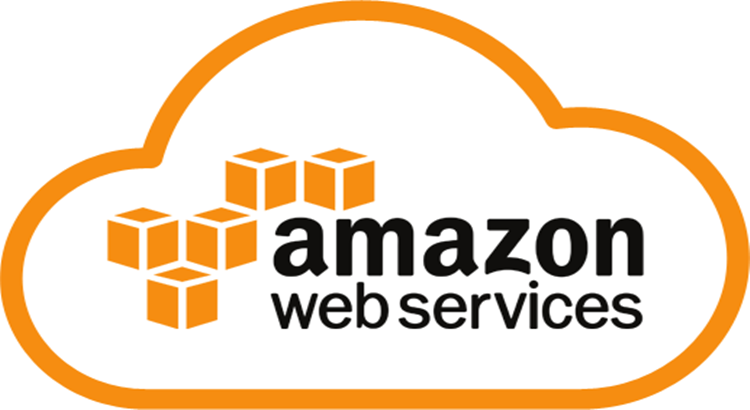

# 

# Introdução ao AWS

## Cloud Compunting

O que e Cloud ?

Cloud e a entrega de recursos de tecnologia e aplicaçoes sobre demanda, utilizando a internet
para entregar e manipular esses recursos com cobranças.

Então, cloud e um servidor terceirizado que faz entrega de dados.

## On-primises

 - data center ou centro de processamento de dados
   - E um predio ou area feita para concentrar servidores, 
  equipamentos de processamento e armazenamento de dados.
 - objetivo
   - Feito para atender demandas computacionais de uma ou mais empressas que trabalham com banco de dados, com um sistema complexo de rede onde se concentram
  switches, cabos, roteadores e etc.

Com isso, on-primise e um servidor pessoal fisico que e da propria pessoa ou empressa 
que detem ele.

## Modelos de Serviços

Modelos de serviços, são formas que a cloud tem serviços para oferecer para você.

 - IaaS
   - E o famoso s2, aqui você sobe suas maquinas, desce suas maquinas, configura elas, middleware eo sistema operacional que roda nela.
 - Paas
   - E mais focado para desenvolvedores, negocios. Sua as configuraçoes aqui sao apenas de dados e as aplicaçoes que irão rodar. A runtime, sistema operacional e configuração de ambiente, nao precisa, aws fazs isso por você. 
 - Saas
   - Software como serviço, aqui você apenas coloca a aplicação para rodar e pronto.

## Serviços Cloud

### 

Principais serviços:

 - Compute
   - Amazon s2, que e um IAs.
   - Aws Lambda.
 - Storage
   - Amazon Cloud front, para entrega de conteudo.
   - Amazon Glacer, para armazenamento de dados frios.  
 - Management and Security
   - Aws Storage Gateway
   - Amazon Content Delivery
 - Database
   - Amazon Dynamo DB, banco dados NoSQL.
   - Amazon RDS, Oracle, SQL Serve, PostGre etc...
   - Amazon Redshift, para trabalhar com silos de dados.
   - Amazon Elastic Cache, para trabalhar com dados em memoria.
 - Network and Connectivity
   - Amazon Route 53, para trabalhar com DNS, dominios etc...
   - Amazon VPC, para criar redes internas e subredes dentro dos dominios da AWS.
   - AWS Direct Connect, para fazer uma conexão direta de um ponto ao outro de forma segura e extremamente rapida.
  
  Outros serviços:

  - AWS IAM
    - AWS IAM e a primeira coisa que voce tem que    criar, voce acessa pela sua conta root, dai você  cria seus grupos e usuarios que irão acessar o seu console ou que ira fazer um acesso programatico pela API. De todos os serviços da aws, esse e o mais importante.
  - AWS SWOT 
    - Faz a analise e monitoramento de metricas do que esta sendo consumido, para saber tudo que esta sendo contado, cobrado, contabilizado e quais horarios que esta sendo usado. Ele e muito bom para saber tudo que esta sendo feito.
  - AWS Code Deploy
    - Para fazer deploy de codigo, colocar suas aplicaçoes, criar pipelines, conexao com git.
  - Amazon Kinesis
    - Basicamente e feito para analise de dados, para quem trabalha com analytics.
  - Amazon SQS
    - Trabalha com mensageria.

##  Regios da AWS

### 

Aws tem data-center em todos os continentes do mundo, exeto antartida.

### Região

Região e onde a AWS concentrar o seu data-center, por questões de segurança, não se sabe onde ficam os data-center, apenas a sua região.

### Pontos de presença da borda (Edge POP)

São impressas parceiras que fazem conexão com data-center da AWS. Numca se acessa a AWS direto, sempre se acessar por essas bordas, um Edge nodes. Que e um servidor de borda que vai fazer intermedio ate a AWS.

## Profissoes Cloud

- Cloud enginers
  - Resposanvel por desenvolver e trabalhar com infra e com software, prontos para lidarem com problemas.(Software)
- Cloud Architects
   - Responsavel por desenhar soluçoes e ssitemas, conhecendo segurança, redes, virtualização e o ambiente cloud que se esta utilizando. (Arquitetura)
- Cloud OPS
   - Resposanevl pela sustentação da infra e segurança. (Infraestrutura)

## Indentity and access management - IAM

Resposanvel por gerenciar as chaves de acesso da aws. Com isso você pode dar e restringir acessos, criar e deletar usuarios e grupos. E a peça mais importante dentro da aws, pois e ela quem garante a sua segurança.

O AWS IAM e um recurso da sua conta, e tambem e oferecido de forma gratuita.

### Caracteristicas do IAM

- Acesso compartilhado a sua conta AWS
   - Você pode criar varios usuarios, da credenciais a eles, temporarias ou não. Com isso você restringe acessos da sua equipe. 
- Permissẽes granulares
   - Gerencia funçoes aos usuarios como, deletar, criar etc...
- Federação de entidades
  - Possibilita espelhar suas atuais permissoes que estão em um OnePrimise por exemplo, direto para a Cloud ou seja, ele migra. Ela so da suporte ao SAML 2.0
- PCI DSS Compliance
  - Payment Card Industry Data Security Standard ou Padrão de Segurança de Dados da Industria de Pagamento com Cartão, norma que define um grupo de requerimentos que visam proteger informaçoes pessoais de titulares de cartão de credito, a fim de reduzir danos e fraude.

### Usuários, Grupos, Politicas e Permissões

 - Usuarios(users)
   - Conceito utilizado para toda entidade da aws, deve ser atribuida somente uma pessoa ou aplicação. 
 - funçoes(roles)
   - Conceito referente ao que um usuario, grupo ou funçoes pode ou não fazer dentro da aws. 
 - Grupos(groups)
   - Um conjunto ou coleções de varios usuarios, que terão os mesmos privilegios. 
 - Politicas(policies)
   - Define o que e permitido e o que não e permitido em qual quer nivel de entidade.

### Security Group Intro

 - Grupos de segunraça, facilitam a segurnaça em criar um firewall virtual que controla o trafego de uma ou mais instancias.
 - Tambem permite regras de liberação de acessos

### Melhores praticas do IAM

 - Cada usuario deve possuir permissoes para executar apenas suas atividades de acordo com suas responsabilidades.
 - Um usuario apos sua criação, nao possui nenhum privilegio por default.
 - Definiçoes de permissao de usuarios atraves de groups e policies
 - Trabalhar sem dependencia da infra provida on-premises.
 - Seguir principio do menor privilegio 
 - Nao utilizar usuarios para logar em aplicaçoes
 - Conta root deve possuirt MFA
   - MFA e uma atentição por token. 
 - Não utilizar conta root, somente para configuração inicial
 - Não compartilhar credenciais IAM
 - User IAM por pessoa

## Segurança de computação e rede

### Segurança VPC

 - Security Groups
   - Associado como um firewall para instancias EC2.
   - Controla trafego inbound e outbound.
   - Pode ser usado como unica barreira de acesso a sua VPC.
   - Avalia todas as regras antes de permitir o trafego.
   - E associado a redes das instancias. 
 - NACLs
   - Associado com um firewall para subnets
   - Controla trafego inbound e outbound na camada de subredes
   - Aplicado a todas as instancias associada a apendas uma ACL, uma ACL pode ser associada a mais de uma subnet.

### Boas praticas de segurança

 - Rede
   - Definição de ANGES de ips
     - qual numero que ele podera ser associado 
   - Internet gateway(internet)
   - virtual private gateway
     - Para acesso entre VPCS ou on-primises

## EC2

 - Amazon Elasctic Compute Cloud
   - (Amazon EC2) e um web service que disponibiliza capacidade computacional segura e dimensional na cloud. E uma forma rapida de iniciar recursos computacionais, facilitando a forma de inicializar e dimensionar suas intancias.

### AMI Amazon Machine Image

 - AMI e um template contem configuraçoes de software (S.O, APP server e web server)
 - facilita a criação de uma ou varias instancias a partir de uma unica AMI, que gera copias
 - Pode ser configurada e ser personalizada com software especifico ou proprietario
 - As instancias podem ter discos locais (boot), ter amazon EBS (dados) ou ter volumes mapeados no Amazon s3

Basicamente o conceito disso e replicar uma imagem, por exemplo:

Você configura todo um sistema, para nao ter que configuralo novamente, você cria uma imagem dele. Assim não nessecitara de refazer as configuraçoes, alem disso essa imagem podera ser replicada em outros lugares, evitando assim todo retrabalho.

### Elastic Ip

O elastic ip e um endereco publico que e associado a conta que permite que o ip publico da instancia tenha acesso a internet sem a necessidade de um NAT.

 - Podemos ter ate 5 elastic ip por conta, para mais e preciso abrir ticket para AWS
 - Elastic ip e uma fragilidade em qualquer arquitetura e nao recomendado para ambiente de produção.

### User Data

Utilizado para executar comandos quando uma instancia e criada, podendo ser Bash, shell etc. Os cripts inseridos no user data, sao executados somente uma unica vez, apenas na criação da instancia.

Ele e sempre executado com usuario root.

## Billing EC2

