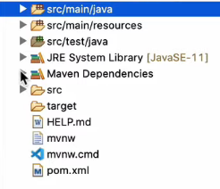
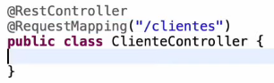

# 

### Sumário

1. [Introdução](#introducao)
2. [Criando controller](#criando_controller)

<br />

### Introdução <a name="introducao">

Para a introdução, devera ser instalado os startes.

### Dependências
 - Maven

### Starter
startes e um conjunto de dependências que o springboot disponibiliza para ser criado a API, sendo assim, acelerando a produtividade e evitando erros de conflitos.

### Instalar
  - spring Web
    - carrega com ele várias outras dependências transitivas.
  - Spring Boot DevTools
    - Ira ajudar na produtividade durante o desenvolvimento, quando for feito uma alteração em alguma ***class*** por exemplo, ele fara ***reload*** da aplicação.
  - Spring Data JPA
    - Ira fazer a percistencia de dados com o banco.
  - H2 Database
    - E um banco de dados em memoria que sera utilizado apenas para demonstração.
  - Lombok
    - Uma dependencia que incurta o codigo fonte, não tendo nessecidade de escrever os Getter and Setter.

Projeto criando!



Caso você não tenha o serviço do **start.spring**, podera fazelo pelo endereço: [start.spring.io](https://start.spring.io/)

<br />

***@SpringBootApplication***
  - Anotação que fica dentro da classe principal do springboot. Ela e responsanvel por inicial a aplicação. Ela ira lenvantar um servelet container, que por padrão e o tomcat.

### Criando o controlador <a name="criando_controller">

Controlador e a classe que recebe as requisiçoes http e devolve uma resposta.


Crie a pasta ***controller*** e dentro dela arquivo ***ClienteController.java***

***@RestController***
  - Basicamente essa anotação diz que a classe e um controlador Rest.

***@RequestMapping***
  - Ira mapear os endPoints que serão /clientes



Dentro da classe **ClienteController**, sera colocado metodo:

```
@Getmapping
public String hello() {
  return "Ola, mundo";
}
```
***@GetMapping***
  - Quando a requisição chegar no endPoint **/clientes**, esse sera o metodo que ira responder a requisição, descrito a cima.

A classe devera ficar toda assim:

```
@ResquestController
@RequestMapping("/clientes")
public class ClienteController {

  @Getmapping
  public String hello() {
    return "Ola, mundo";
  }
}
```

Se for feito uma requisição agora no endPoint clientes, sera retornado Ola, mundo.

Agora, remova o metodo Hola mundo e no lugar deste adicione:

```
@GetMapping
public List<Cliente> listar() {

}
```

Aqui ele ira retornar uma lista de cliente, mas para isso devera criar uma classe Cliente para ser ***Model***.

```
public class Cliente {

private Long id;
private String nome;
}
```

Agora podera importar a classe cliente para metodo de listar.

<br />

### Mapeamento com JPA

A Anotação ***@Entity*** do pacote ***javax.persistence***, e uma anotação do JPA e não do SpringBoot. Com isso estamos dizendo que uma classe e uma entidade, uma entidade e mapeada para uma tabela no banco.

  - ***@Id***, quando anotamos com isso, estamos querendo dizer que o atributo id identifica a nossa entidade, semelhante a ***primery key*** (chave primaria).

  - ***GeneratedValue***, especifica a estrategia, ou seja, qual a estrategia de geradores de ***id***.
    - ***GenerationType.EDENTITY***, com isso estamos dizendo que a resposabilidade de encrementar o id e do banco, e nao do Java.
  
  - ***@Column(nullable = false)***, diz que a nossa coluna e ***NOT NULL***, nao pode deixar de ser preenchida.

Por ultimo, devera ser criado os metodos ***Getter*** e ***Setter***. Caso nao queria criar esses metodos, podera usar o ***Lombok***, pois ele gerar os metodos por você. Porem aqui sera utilizado o Lombok com a ***@Data***.

OBS: O lombok alem de ter sua dependencia adicionada no ***pom.xml***, devera ser instalado na IDE.

```
@Entity
public class Cliente {
  
  @Data
  @Id
  @GeneratedValue(strategy = GenerationType.EDENTITY)
  private Long id;
  
  @Column(nullable = false)
  private String nome;
}
```

### Implementando um Repository

Repository e uma classe responsavel por interagir com banco de dados.

Primeiro passo e criar uma interface com nome ***ClienteRepository.

Ira extender a classe ***JpaRepository***, informando no ***List***, nome da classe e o tipo do Id, que seria Cliente com id do tipo Long.

***@Repository***, diz ao spring que este e um componente do tipo respository.

O repository nao precisa de implementação, pois o ***Spring Date JPA*** ja disponibiliza uma implenetação em tempo de execução.

```
@Repository
public interface ClienteRepository extends JpaRepository<Cliente, Long> {

}
```

Dentro do ***ClienteController***, adicione a linha:

```
@Autowired
private ClienteRepository clienteRepository;
```

  - ***@Autowired***, vai ingetar uma instancia de ***ClienteRepository*** dentro de ***ClienteController***

Dentro do List, adicione a linha:

```
return  clienteRepository.findAll();
```

Devera ficar tudo desta forma:

```
@ResquestController
@RequestMapping("/clientes")
public class ClienteController {

  @Autowired
  private ClienteRepository clienteRepository;

  @Getmapping
  public String hello() {
    return clienteRepository.findAll();
  }
}
```

Iniciando a aplicação agora, se for feito uma Request em ***/clientes***, sera notado que retornara um array vazio "[]" e status code 200 OK.

### Implementando metodo POST

Dentro de ***ClienteController*** insira a linha:

```
@PostMapping
@ResponseStatus(HttpStatus.CREATED)
public Cliente adicionar(@RequestBody Cliente cliente) {
  return clienteRepository.save(cliente);
}
```

  - ***@RequestBody***, o corpo da requicisao, sera convertido para o objeto java do tipo cliente.

  - ***@PostMapping***, Especifica um metodo de POST.
  
  - ***@ResponseStatus(HttpStatus.CREATED)***, Depois que executar o metodo com codigo padrao de sucesso "200 OK", retorne CREATED 201.
