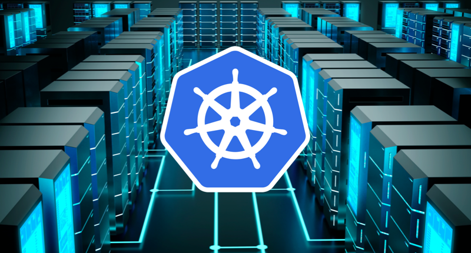

[Material de referencia](https://www.youtube.com/watch?v=5unI7VPnASM&t=6138s)

O kubernetes e um orquestrador de container. Vendo a necessidade de alta escalabilidade, o kubernetes se ve necessario, imagine a situação de ter que gerenciar muitos containers docker, o kubernetes faz isso por voce.

## Configmap

Configmap e um arquivo que injeta dados de configuração no container.

Basicamente o configmap e um unico arquivo de configuração para mais de um container, facilitando para que nao tenha a necessidade de configurar os containers de um a um.

## Secrets

A secret salva senha no kubernetes e recupera ela dentro do container.

## Load Balancer

Load balancer e um balanceador de carga. Ele equilibra o nivel de carga entre os containers para que nao fiquem sobrecarregados.

## Service Discovery

O service discovery tem um registro de todos os containers e junto com o load balance ele delega para qual container ira a massa de dados, sua prioridade e o container que estiver mais saudavel.

## POD

POD e uma unidade, um envolucro que sela um container, ou seja o POD ele envolve um container e sela ele. Por padrao um POD sempre tera um container dentro, mas pode aver casos exepcionais em que se tem mais de um container dentro de uma POD, mas isso nao e aconselhavel fazer.

O POD ele verifica se o container esta com qualidade o sulficiente para rodar o container.

```
    POD           
    .________________.
    |                |
    |    Container   |
    |________________|                                                
```

## ReplicaSet

O replicaset monitora a todo tempo a quantidade de POds que estao no ar.

O replicaSet pode ser configurado por exemplo para o tempo todo esta rodando dois PODs, caso um POD morra, o replicaSet ira replicar esse POD novamente do zero.

O replicaSet tambem quarda a versao do container. 

```
ReplicaSet
._____________________________________________________.
|   POD                          POD                  |
|   .________________.           .________________.   |
|   |                |           |                |   |
|   |  |Container|   |           |   |Container|  |   |
|   |________________|           |________________|   |
|                                                     |
|_____________________________________________________|
```
## Deployment

Por de cima do replicaSet temos o deployment. O deployment ele garante qe consiga gerar uma nova versao, garante tambem o replicaSet, ele tem por de dentro o replicaSet que garante a quantidade de replica de PODs.

```
Deployment
._________________________________________________________________.
|    ReplicaSet                                                   |
|    ._______________________________________________________.    |
|    |                                                       |    |
|    |   POD                          POD                    |    |
|    |   .________________.           .________________.     |    |
|    |   |                |           |                |     |    |
|    |   |   |Container|  |           |   |Container|  |     |    |
|    |   |________________|           |________________|     |    |
|    |                                                       |    |
|    |                                                       |    |
|    |_______________________________________________________|    |
|_________________________________________________________________|
```

## Service

```
Deployment
._________________________________________________________.
| ReplicaSet                                              |
| ._____________________________________________________. |
| |                                                     | |
| |  POD                         POD                    | |
| |  .________________.          .________________.     | |  ._________.
| |  |                |          |                |     | |  |         |
| |  |   |Container|  |          |   |Container|  |     | |  | Service |
| |  |________________|          |________________|     | |  |_________|
| |                                                     | |
| |                                                     | |
| |_____________________________________________________| |
|_________________________________________________________|
```

O service ele possibilita que outras pessoas ou sistemas acessem o deployment, conseguentemente acesso aos PODs. Ele fica de forma externa em relação a o deployment.

No service e feito uma configuração apartir de uma label chamda ***selector***.

Exemplo disso e que a selector pode ser chamda de ***app:front*** ou ***app:back***. Dessa forma podemos diversificar o selector para uma aplicação front end ou back end por exemplo.

OBS: Cada deployment tera o seu service.

Utilizando o service, existe algumas possibilidades:

 - Gerar um ip interno.
 - Gerar um ip externo, para acesso externo.
 - Disponibilizar uma porta.


