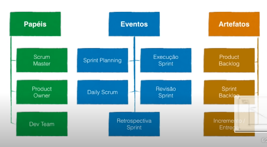
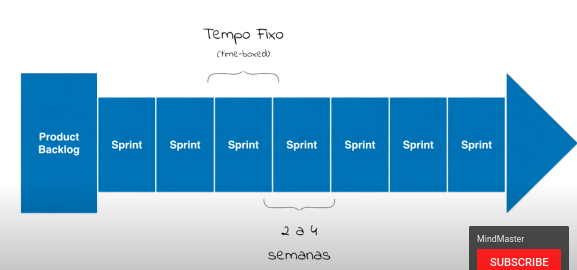
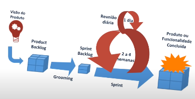

# Metodologia scrum

Scrum e um framework simples para gerenciar projetos complexos.

Quando temos projetos em que a tecnologia e os requesitos sao bem definidos, podemos usar metodologias em cascatas. Porem quando conhecemos menos os requesitos e a tecnologia e mais complexas, se adota o scrum.

Scram possui 3 pilares fundamentais:
 - transparencia: dos processos, requesitos de entrega e status.
 - inspeção: constante de tudo o que esta sendo feito.
 - adaptação: tanto do processo quanto do produto.

 ## Praticas fundamentais

***Product Owner*** e o ponto central com poderes de liderança sobre o produto e qual a ordem em que ele deve ser feito. E ele quem prioriza os itens do backlog.

***Scrum Master*** e o resposanvel por ajudar a todos os individos a
entender abraçar os valores e praticas do scrum.

***Dev Team*** sao os desenvolvedores do projeto, no projeto sao eles
quem decidem com serao feita as coisas.

## Dinamica so scrum

Tudo começa com a visao do produto, e quem prove isso e o ***Product owner***.

Depois essa visão de projeto deve ser desmenbrada em funcionalidades que 
a chamamos de ***Product Backlog***. O Scrum master auxilia o ***Product Owner***.

As funcionalidades sao divididas em prioridades:
 - imprescindivel
 - importante
 - seria bom ter

 Essa priorização e responsabilidade do ***Product Owner***.

 ## Scprints

O projeto e planejado em sprints, que sao periodo de tempo
Todos os sprints devem respeitar uma duração que deve ser de 
2 a 4 semanas.

Antes de cada sprint começar, deve ser feito a Sprint Planning. 
Que e uma reunião de planejamento da sprint, na sprint planning
sera criado o backlog da sprint.

Todo dia de manha e feito uma reunião com cada membro do time.
Nela e feito 3 perguntas basicas.

 - O que fez ontem?
 - O que vai fazer hoje?
 - Tem algum impedimento?

## Sprint Review

Objetivo dessa atividade e validar e adaptar o produto que esta
sendo construido. E verificar se o que esta sendo feito esta 
de acordo com o esperado. Aqui e feito a apresentação do que foi feito na sprint, e aqui que pode surgir as mudanças, para
o produtc backlog ser atualizado.

## Restrospectiva

Tem como objetivo verificar nessecidades de adaptação no processo
Aqui sera visto:
 - O que foi feito
 - O que nao foi feito
 - O que deve melhorar
 - O que deve parar de fazer.

