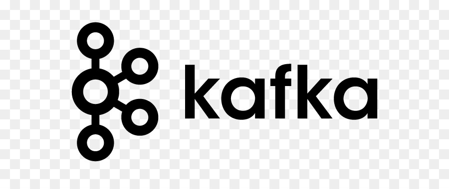
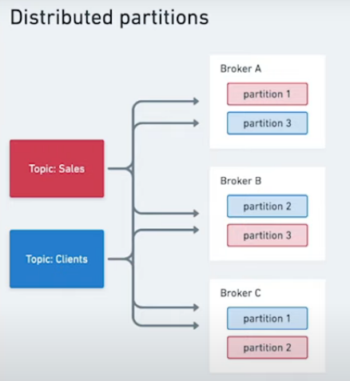
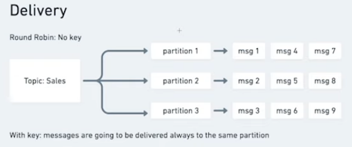

# 

Apache kafka e um sistema open source, trabalha de forma distribuida, para trabalhar com stream de dados. Ex:

Eu tenho dado, informacao, quero passar de um sistema para outro, quero armazenar essa informacao para poder consultar depois, quero poder pegar essa informacao, transformar esses dados para jogar em um outro sistema. Sistema apache kafka e um sistema muito poderoso, nele voce pode trabalhar no formato de filas e outros.

Apache kafka alem de manipular informacoes, ele consegue guardar informacoes para que possa ser usada futuramente.

### Producer

O ***producer*** e qualquer sistema que vai produzir os dados que sera manipulado e encaminhado para apache kafka. Apache kafka funciona no formato um ***cluster***, ou seja, voce tem diversas maquinas rodando o pache kafka, e cada maquina dessa e chamada de ***broker***.

O kafka e um cluster com diversos ***brokers***, e cada ***brokers*** tem seu proprio banco de dados.

O ***consumer*** e o sistema que esta interasado em pegar essa informacao que esta no kafka.

O ***Zookeeper*** e utilizado para gerenciar erros e fazer recuperacao, ou seja, se broker A cair, ele consegue redirecnionar para broker B ou outros.

### Topics

Topico seria como um cano, em que jogamos a informacao nele, e essa informacao fica armezanada no apache kafka, ou seja, quando eu precisso produzir uma mensagem, essa mensagem sera enviada para um topico. ***Producer*** manda uma mensagem para para o ***topics***, ***topic*** ira gravar essas informacoes no ***broker***, e o ***consumer ira ficar lendo esse ***topic***.

O topico ele funciona como se fosse um log, um atras do outro.

Quando e enviado uma mensagem, essa mensagem vai para a particao ***Sales***, a mensagem cai em uma caixinha, essa caixinha e chamada de offset.

 

- ***key***. A key ira ajudar a manter o contexto de uma mensagem. Ex:
  - Tenho meu topico de vendas, toda vez que acontece uma venda, eu mando uma mensagem para la. Quando sai uma venda, existe uma mensagem expecifica, que eu quero mandar, que vai servir somente para o sistema de entrega(Sitema de chiping). Entao eu coloco na ***key***. OBS: Nao e obrigatorio o uso de ***key***.

- **Value**, basicamente e o payload da mensagem, pode carregar um json, arquivo texto, protocols buffers e de diversas outras formas.

- **Timestamp**, se o timestamp nao for setado, ele sera gerado automaticamente.

Log compactado consegue pegar resumo da posicao atual que esta a mensagem.

 

### Particoes distribuidas e Producers

As particoes trabalham de forma distribuida entre os brokes do apache kafka.

Temos dois topicos, um chamado de **Sales** outro de **Clients**. Nota-se que independente dos topicos, o kafka ira tentar distribuir as suas particoes entre os brokers.

Uma coisa que fica muita clara, e que se o **Broker B** cair, ainda sim teremos os dados da particao 2 e 3 disponiveis, pois se encontram tambem em outros brokers.

O que garante essa distribuicao de dados replicados em os Brokers, e chamado de ***Replication Factory***.

O replication factory ajuda a garantir que tenham replicas de uma particao em outros brokers tambem.

O processo de entrega das mensagens, por padrao o kafka nao gera uma regra principal para entregar as mensagens em cada particao.

Imaginemos o seguinte caso, foi enviado uma mensagem, porem essa mensagem nao tem ***key***, a mensagem entao ira cair em **Topic**, depois em partion. O que tem que se atentar e que cada mensagem que e enviada, ela ira parar em particoes diferentes, sobre isso nao se tem controle, apenas as que nao tem uma ***key***, pois se uma mensagem tiver uma ***key***, ela sempre estara na mesma particao, e nao espalhada. 

OBS: Se numca tiver a chave "key", numca sabera qual mensagem que chegou primeiro.

