# 

Apache kafka e um sistema open source, trabalha de forma distribuida, para trabalhar com stream de dados. Ex:

Eu tenho dado, informacao, quero passar de um sistema para outro, quero armazenar essa informacao para poder consultar depois, quero poder pegar essa informacao, transformar esses dados para jogar em um outro sistema. Sistema apache kafka e um sistema muito poderoso, nele voce pode trabalhar no formato de filas e outros.

Apache kafka alem de manipular informacoes, ele consegue guardar informacoes para que possa ser usada futuramente.

### Producer

O ***producer*** e qualquer sistema que vai produzir os dados que sera manipulado e encaminhado para apache kafka. Apache kafka funciona no formato um ***cluster***, ou seja, voce tem diversas maquinas rodando o pache kafka, e cada maquina dessa e chamada de ***broker***.

O kafka e um cluster com diversos ***brokers***, e cada ***brokers*** tem seu proprio banco de dados.

O ***consumer*** e o sistema que esta interasado em pegar essa informacao que esta no kafka.

O ***Zookeeper*** e utilizado para gerenciar erros e fazer recuperacao, ou seja, se broker A cair, ele consegue redirecnionar para broker B ou outros.

### Topics

Topico seria como um cano, em que jogamos a informacao nele, e essa informacao fica armezanada no apache kafka, ou seja, quando eu precisso produzir uma mensagem, essa mensagem sera enviada para um topico. ***Producer*** manda uma mensagem para para o ***topics***, ***topic*** ira gravar essas informacoes no ***broker***, e o ***consumer ira ficar lendo esse ***topic***.

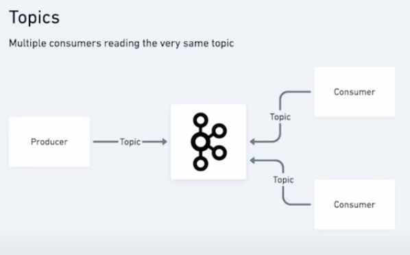

O topico ele funciona como se fosse um log, um atras do outro.

Quando e enviado uma mensagem, essa mensagem vai para a particao ***Sales***, a mensagem cai em uma caixinha, essa caixinha e chamada de offset.

 

- ***key***. A key ira ajudar a manter o contexto de uma mensagem. Ex:
  - Tenho meu topico de vendas, toda vez que acontece uma venda, eu mando uma mensagem para la. Quando sai uma venda, existe uma mensagem expecifica, que eu quero mandar, que vai servir somente para o sistema de entrega(Sitema de chiping). Entao eu coloco na ***key***. OBS: Nao e obrigatorio o uso de ***key***.

- **Value**, basicamente e o payload da mensagem, pode carregar um json, arquivo texto, protocols buffers e de diversas outras formas.

- **Timestamp**, se o timestamp nao for setado, ele sera gerado automaticamente.

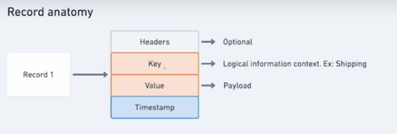

Log compactado consegue pegar resumo da posicao atual que esta a mensagem.

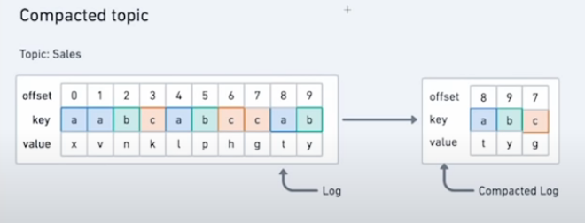

 

### Particoes distribuidas e Producers

As particoes trabalham de forma distribuida entre os brokes do apache kafka.

Temos dois topicos, um chamado de **Sales** outro de **Clients**. Nota-se que independente dos topicos, o kafka ira tentar distribuir as suas particoes entre os brokers.

Uma coisa que fica muita clara, e que se o **Broker B** cair, ainda sim teremos os dados da particao 2 e 3 disponiveis, pois se encontram tambem em outros brokers.

O que garante essa distribuicao de dados replicados em os Brokers, e chamado de ***Replication Factory***.

O replication factory ajuda a garantir que tenham replicas de uma particao em outros brokers tambem.

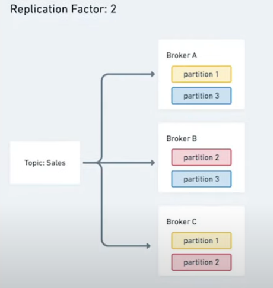

O processo de entrega das mensagens, por padrao o kafka nao gera uma regra principal para entregar as mensagens em cada particao.

Imaginemos o seguinte caso, foi enviado uma mensagem, porem essa mensagem nao tem ***key***, a mensagem entao ira cair em **Topic**, depois em partion. O que tem que se atentar e que cada mensagem que e enviada, ela ira parar em particoes diferentes, sobre isso nao se tem controle, apenas as que nao tem uma ***key***, pois se uma mensagem tiver uma ***key***, ela sempre estara na mesma particao, e nao espalhada. 

OBS: Se numca tiver a chave "key", numca sabera qual mensagem que chegou primeiro.

### Partition leadership - Quais sao as particoes que sao lideres dos brokers

Quando temos o replication factory, uma de nossas particoes sera conciderada lider. As particoes que estao em azul, serao as lideres, as que estao em branco, serao as follows. Isto siquinifca que apesar de ter a particao (A), e ter replicas da particao (A) na particao (B), isto significa que no topic azul eu tenho uma replica. Isso significa toda vez que alguem estiver consumindo uma mensagem, ela sempre vai consumir do lider primeiro, o inverso so ira acontecer se broker (A) cair.

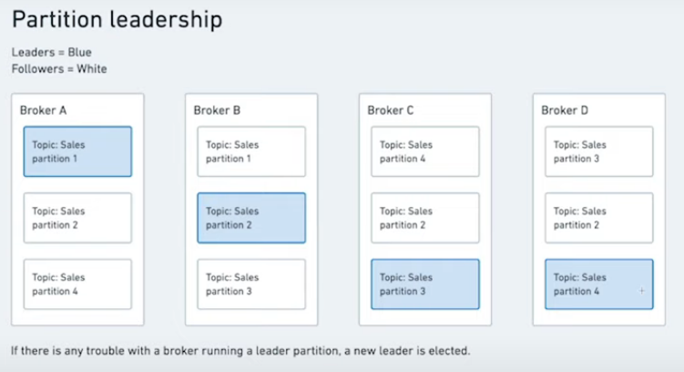

### Producer

No processo de entrega da mensagem, na sua cricao, sera especificado ***Topic***, ***Key***, ***Value***. Apartir disso sera feito um ***send()*** (envio), depois kafka ira tentar adequar o formato correto que ele ira serializar, depois ele ira escolher em qual particao essa mensagem sera gravada, depois ira gravar a mensagem em uma ***broker*** (particao).

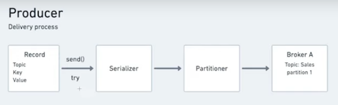

### Tres formatos de entrega do kafka

O kafka ele quer ter garantias de entrega dessas mensagens que serao enviadas. Para isso existem 3 formatos de entrega.

- ACK 0
   - Existem alguns casos, em que pode perder mensagens. O kafka ele tem algo chamado ***acknowledgment*** (ACK), isso e para garantir que a resposta do kafka foi entregue, e muito semelhenta ao protocolo de resposta ***tcp/ip***.
   ACK 0 significa que nao ira espera se o kafka conseguiu gravar a mensagem no broker.
   
   - Esse tipo de processo e mais rapido, pois o kafka nao perde tempo respondendo que recebeu a mensagem, com isso ele pode receber mais mensagem para gravar.
- ACK 1
   - No segundo caso, sera enviado a mensagem ao kafka de confirmacao de envio. Assim o broker (A) ira responder a mensagem confirmando que a recebeu.
   
   - Nessa abordagem, eu tenho uma garantia que a mensagem foi entregue.

- ACK -1
  - Existem casos, em que voce quer ter uma garantia muito grande de entrega, a mensagem sera enviado para broker (A), e o broker(A) ira replicar no broker(B) e no (C) de acordo com ***replication factory***, quando broker (B) e (C) retornar a mensagem para broker (A) que a mensagem foi replicada, ai sim o broker(A), retorna para producer a confirmacao de gravacao da mensagem.
  
  - Nesse caso a garantia de entrega da mensagem e total, porem exige um maior tempo de processamento.

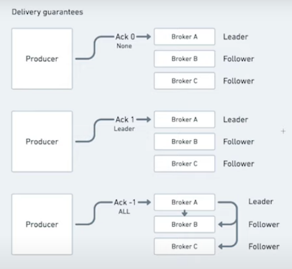

Existe outro esquema na hora da entrega, eles sao divididos em tres:

 - At most once
   - Esquema de entrega de mensagem em que pode se perder uma ou outra mensagem, aqui tera uma super performase, mas eventualmente, nao a problema se ouver perde de algumas mensagens.
 - At least once
    - Esse e o mais usado, ele garante que as mensagens sejam entregues pelo aumenos uma vez. 
 - Exacly once
    - Tem a pior performase, entre tanto, o kafka garante que a mensagem sera entrege ao menos uma vez, ele nao vai perder nenhuma mensagem e nao vai mandar a mais.

### Idempotent producers

Se setar que os idempotent como ***OFF***, tera como duplicar uma mensagem.

Caso seja ***ON***, ele ira descartar a mensagem duplicada.

### Consumer

Consumers sao os respodensaveis para ler as mesangens, consumer pode ser qual quer programa, basta que ele leia as mensagens para ser um consumer.

No outro caso, temos o consumer group. Aqui sao mais de um consumidor no mesmo grupo. Lenbrando que o consumer pode ler de diversas particoes diferentes, porem isso consome mais tempo. 

Para se extrair o maximo de proveito do kafka, vale ter para o mesmo numero de particoes o mesmo numero de consumer

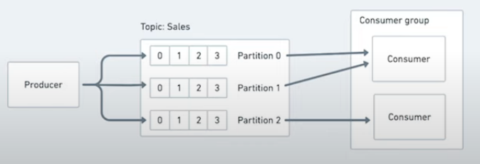

### Consumer rebalances

Imagine o seguinte senario, por alguma problema na maquina ela cai, o kafka sabe na hora que esse consumer parou de responder, nisso ele rebalanceia para garantir que nenhuma ***partition*** fique apontanto para consumer que esta off.

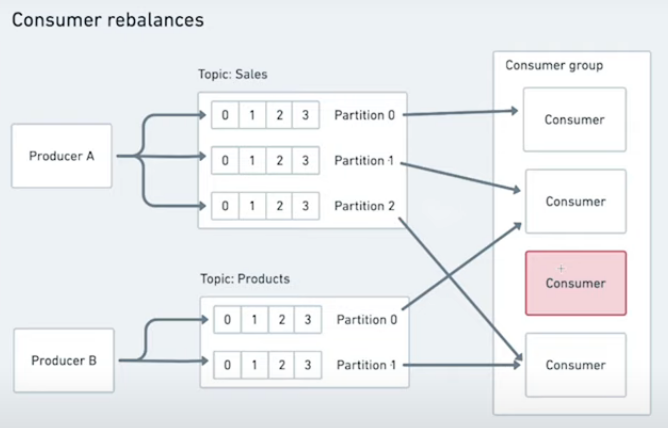

### Security

O kafka tambem pode trabalhar coom processo de incriptacao de mensagens, isso significa que quando eu mando uma mensagem, do producer ate o kafka, essa mensagem seja criptografada, e possivel tambem que a mensagem do broker ate o consumer seja criptografada, mas quando a mensagem for gravada no broker, ela nao e gravada criptografada.

OBS: kafka so criptografa a mensagem no processo de transmicao e nao na gravacao dela. O kafka cconsegue trabalhar tanto com autenticacao e autorizacao.

### Kafka Connect

Basicamente o que o kafka connect faz e jogar informacoes de um lugar e jogar para outro.

A ideia do kafka connect, e que ele tem diversos connectores, e esses conectores conseguem pegar os dados, por exemplo, vindo do twiter, do twiter para um topico.

OBS: O kafka connect nao e o kafka.

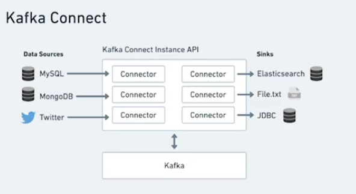

### Connector Sink

Ao inves de pegar de um datasorce e jogar em um topico, eu consigor pegar de um topico e jogar em uma outra fonte de dados.

### Kafka REST Proxy

Ele permite que a aplicacao faca request HTTP, essa request vai cair no REST Proxy do kafka, esse REST Proxy vai jogar a mensagem para kafka.

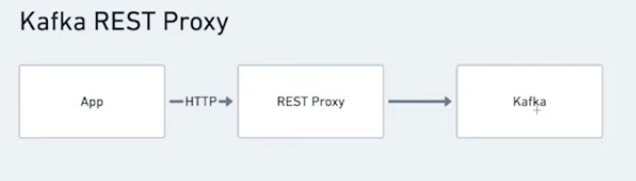

### Data compatibilty

Agrande sacagem desses sistemas de mensagem, e que eles conseguem mandar mensagens de um lado para outro. Mando uma mensagem de um produtor para kafka, e um consumidor le essa mensagem. O ponto e, qual o padrao dessa mensagem?

Sempre que e enviado uma mensagem, tem um serializer, ele ira serializar essa mensagem no padrao que voce vai mandar, em seguida ira enviada a mensagem para o topico. O grande ponto nesse caso do Data compatibility, ira ter um ***Schema Registry***.

***Schema Registry*** e o padrao da mensagem que sera enviada, cada schema tem um ***id***, o ***Consumer*** ira ler a mensagem, mas para isso ele vai la no ***Schema Registry*** e vai pegar dados do schema 123, quando o ***Consumer*** recebe, ele vai dizer, a mensagem esta nesse padrao.

Entao com ***Schema Registry***, voce consegue registrar o padrao em que as mensagens sao enviadas e recebidas. Entao eu nao consigo nem enviar uma mensagem que nao esta seguindo o padrao do ***Schema Registry***.

O kafka permite enviar mensagens em diversos padroes, porem existem os mais comuns.

O apache avro e um json que leva ***namespace, type, name, filds e os types do filds***.

Outro protocolo utilizado e Protobuffer, e aparecido com Apache AVRO so que mais simples.

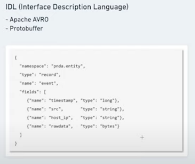

### Kafka Streams

O Streams tambem faz parte do ecossistema do kafka, basicamente e uma biblioteca feita em java. Ele e uma biblioteca que trabalho com realtime e ele ajuda a processar e transformar dados. 

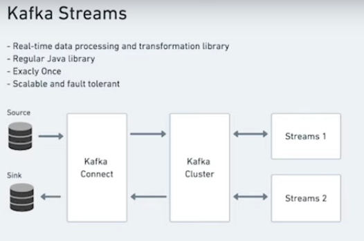

### Confluent ksqlDB

Ja pensou na possibilidade de poder rodar comandos SQL nas filas, e exatamente isso que ksqlDB faz.

Exemplo disso e que toda vez que eu der fizer SELECT no products, eu posso pegar a media dos precos.

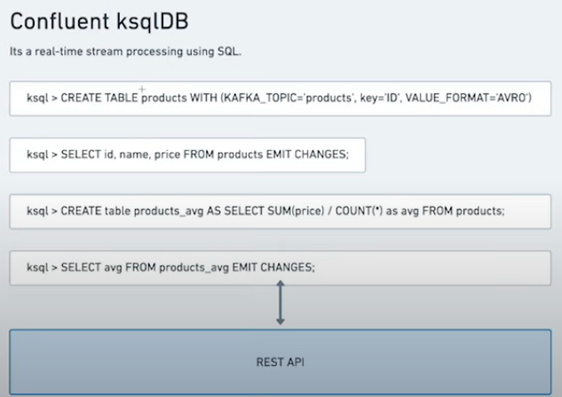