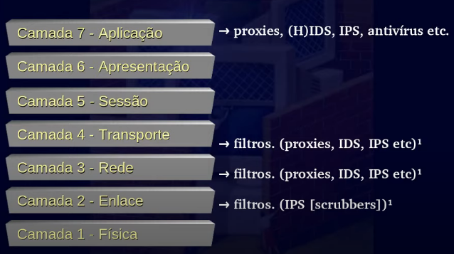
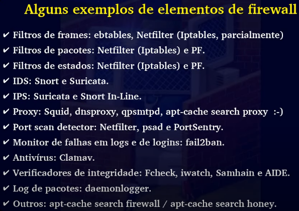
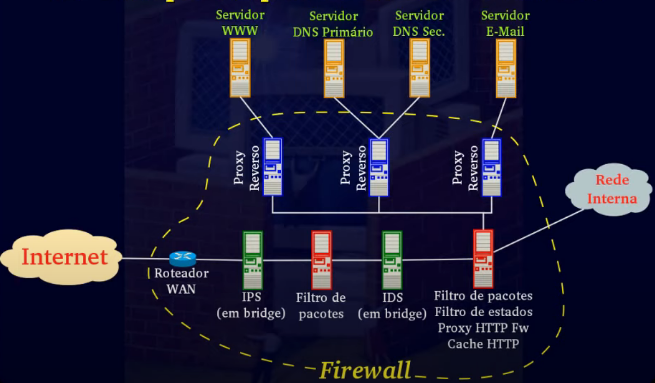

# Sistemas de FireWall

 - Topicos
  - Modelo OSI
  - Roteamneto de redes x bridges
  - Sistemas de firewall
  - DMZ e honeynet
  - Criptografia x Firewall
  - Conclusao
  
   
  
  ### Modelo OSi

     - Ele foi criado pela iso, e possui 7 camadas.
     - A ideia promordial dele era prover compatibilidade entre produtos de rede de fabricantes diferentes.
     - Entao se voce segue o OSI, e produs equipamento de rede, voce vai conseguir falar com outro equipamento de rede que segue o modelo OSI.
     
  So existe protocolo de rede em 4 camadas.
  
  
  
    - 2 Enlase
      - Endereco MAC, bridge, switch.
    - 3 Rede
      - Endereco ip e roteamento de rede.
    - 4 Transporte 
      - Protocolos TCP e UDP.
    - 7 Aplicacao
      - http, ftp, smtp, pop-3 etc.

 

  - Firewall e um conceito, um sistema, todo esforco fisico e logico voltado par seguranca da rede.
  Um sistema de firewall e composto por elemntos, sao eles:
    - Fistros de frames.
      - Trabalham na camada 2, vao filtrar os frames.
    - Filtro de pacotes.
      - Atuam nas camadas 3 e 4, podendo atuar um pouquinho na camada 2.
    - Filtro de estados.
      - Trabalha com estados de conexao.
    - Proxy, forward e reverso.
      - E um elemento intermediario de elemento e servidor, para que o cliente nao tenha contato direto com servidor.
    - IDS.
      - Sistema de deteccao de intrusao. Basicamente ele faz logs, esses log servem para voce saber o que esta aacontecendo na sua rede. 
      - Se o IDS achar que esta acontecendo uma invasao, ele criar logs sobre essa invasao.
      - Se ele ficar na duvida, nao sabendo se e um ataque ou nao, ele criar o log tambem. lenbrando que o IDS tem que dar falso positivo, pois nao se trata de uma inteligencia humana.
      - Uma caracteristica do IDS, e que ele so faz o log, entao o IDS nao causa atrasos na rede e nao requer uma maquina muito poderosa.
    - IPS.
      - Sistema de prevencao de intrusao, ele bloqueia trafego e faz log. Um contra ponto e que voce nao pode ter algo que nao e uma ameaca bloqueado. O IPS quando acredita se tratar de uma ataque, ele bloqueia, quando tem duvida, ele deixa passar.
      - O ideal do IPS e utilizaro apenas para funcoes nobres, pois consome muito processamento. Ele so pode deixar passar um trafego fragmentado depois de ter montado ele na memoria e analisado.
      - Uma coisa que tem que ter obrigatoriamente depois de um IPS e um IDS, por que se um IPS deixou na duvida, alguma coisa passar o IDS vai mostrar.
    - HIDS.
      - E o IDS de Host.
    - Antivirus de rede.
      - E um elento que vai estar no meio do caminho vendo se um trafego tem virus. Entao ele e um elemento de firewall.
    - Verificadores de integridade.
      - Uma coisa que quase ninguem tem, e todo mundo tinha que ter.
    
  Sistemas de FireWall tem que trabalhar com a nocao de profundidade. Tudo separado em maquinas, outra opcao tamebm seria virtualizar cada uma.
  
   
  
  Exemplo simples de uma funcionamento de firewall.
  
     